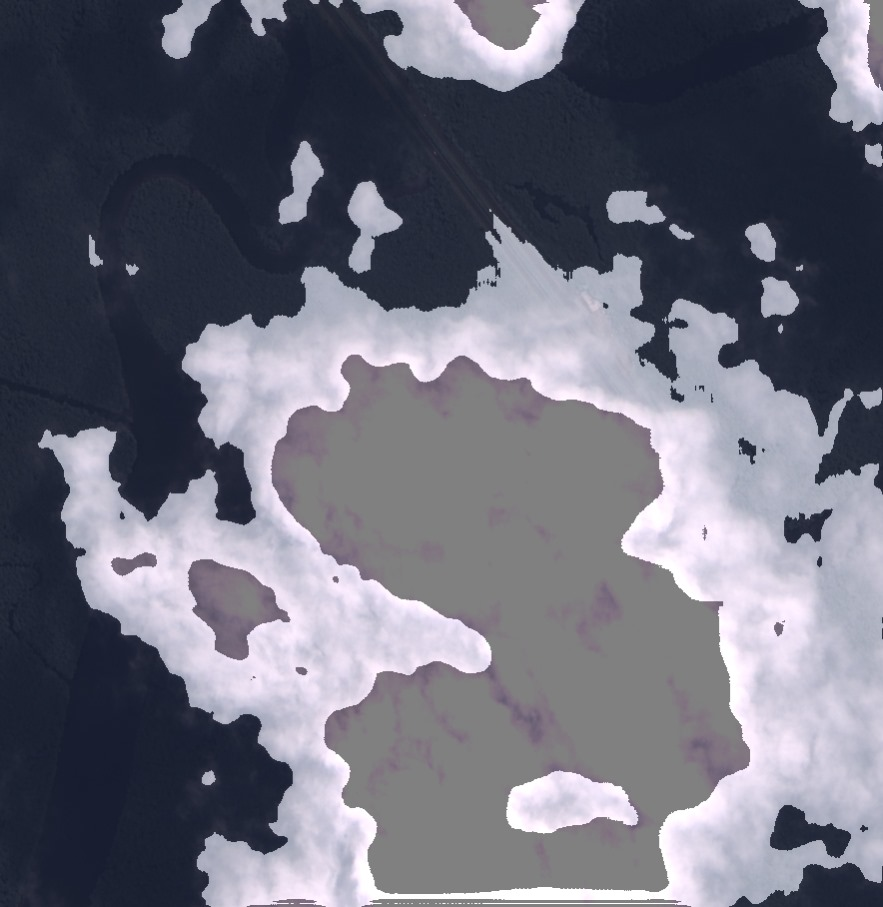

# API para Segmentação de Nuvens em Imagens TIFF

Esta API realiza a segmentação de nuvens em imagens TIFF grandes, usando um modelo de deep learning pré-treinado com a arquitetura U-Net. Ela processa uma imagem de satélite TIFF, aplica filtros de contraste, gera uma máscara de segmentação e devolve a imagem final em formato TIFF com a máscara sobreposta.

## Pré-requisitos

Para executar o projeto, você precisa de:

- **Python 3.7+**
- **Bibliotecas**: 
    - `torch`
    - `torchvision`
    - `Pillow`
    - `Flask`
    - `numpy`

## Instalação

1. Clone o repositório:
    ```bash
    git clone https://github.com/seu-repositorio.git
    cd seu-repositorio/cloud-segmentation/src
    ```

2. Crie um ambiente virtual e instale as dependências:
    ```bash
    python -m venv venv
    source venv/bin/activate  # No Windows: venv\Scripts\activate
    pip install -r requirements.txt
    ```

3. Certifique-se de que o modelo treinado `best_model.pth` está na mesma pasta que o código, pois ele será carregado para realizar a segmentação.

## Arquitetura U-Net

A U-Net é uma rede neural convolucional voltada para segmentação de imagens. Esta versão utiliza o `resnet34` como base para as camadas de codificação, e a decodificação é feita com camadas de `ConvTranspose2d` para restaurar as dimensões da imagem original. A saída do modelo é uma máscara binária indicando as regiões de nuvens.

### Executando a API

1. **Clone o repositório** ou copie os arquivos do projeto para o seu ambiente.
2. **Execute a API** com o comando:
   ```bash
   python main.py
   ```

A API estará disponível em `http://0.0.0.0:8000`.

## Endpoint `/predict`

### Descrição

Este endpoint recebe uma imagem TIFF, realiza a segmentação de nuvens e retorna a imagem final em TIFF com a máscara sobreposta.

### Exemplo de Requisição

- **Método**: `POST`
- **Parâmetros**:
    - `files`: Arquivo de imagem TIFF enviado via `multipart/form-data`.
- **Resposta**: Imagem em formato PNG com a máscara de nuvens sobreposta.

```bash
curl -X POST -F "files=@path/to/your/image.tiff" http://0.0.0.0:8000/predict --output output_image.tiff
```

A resposta será a imagem TIFF sobreposta com a máscara de nuvens.

### Passo a Passo de Processamento

1. **Carregar Imagem e Aplicar Contraste**: A imagem TIFF é carregada e um aumento de contraste é aplicado para melhorar a visibilidade das nuvens.
2. **Segmentação**: A imagem é convertida para tensor e passada pelo modelo U-Net, que gera uma máscara binária indicando as regiões de nuvens.
3. **Sobreposição da Máscara**: A máscara gerada é sobreposta à imagem original para facilitar a visualização.
4. **Retorno da Imagem**: A imagem final com a máscara sobreposta é enviada como resposta no formato PNG.

## Organização de Funções Importantes

- **overlay_mask_on_image**: Sobrepõe a máscara de segmentação na imagem original.
- **segment_image**: Aplica o modelo U-Net para gerar a máscara de segmentação.
- **load_and_apply_contrast**: Carrega a imagem TIFF e aplica um filtro de contraste.

## Estrutura e Explicação do Código

- `UNET`: Define a arquitetura U-Net baseada no ResNet34 para segmentação.
- **Funções de Suporte**:
  - `crop_tensor`: Função que ajusta dimensões de tensores para o U-Net.
  - `predb_to_mask`: Converte a predição do modelo em uma máscara binária para segmentação.

## Espaço para Imagens e Exemplos

- **Exemplo de Input e Output**:
  - Antes da Segmentação:
    
  - Após Segmentação e Aplicação da Máscara:
    

## Considerações Finais

Este projeto foi desenvolvido para facilitar o processamento e segmentação de nuvens em imagens de satélite em grande escala, oferecendo um ponto de partida para melhorias na detecção e análise de nuvens.

---

**Instruções para Contribuição**:
Sinta-se à vontade para enviar sugestões e melhorias para este projeto. 

---

**Observações Adicionais**:
Qualquer dúvida ou erro, entre em contato com o responsável pelo projeto.
